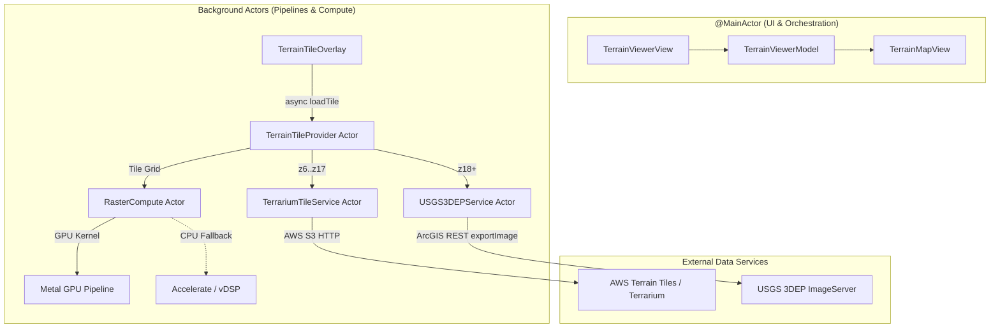

# LidarExplorer

High-performance iOS & iPadOS 17+ terrain viewer powered by USGS 3DEP 1-meter LiDAR elevation data, AWS Terrarium global elevation tiles, and hardware-accelerated Metal compute shaders.

---

## Overview

**LidarExplorer** is a native Swift 6 mapping application designed for geologists, archaeologists, outdoor navigators, and geospatial professionals. It streams, decodes, and dynamically illuminates digital elevation models (DEMs) directly on the device in real time.

Instead of displaying pre-baked, static hillshade imagery, LidarExplorer continuously derives slope, aspect, and multi-directional hillshading from raw float elevation grids using custom GPU compute kernels. Users can interactively manipulate light azimuth and sun altitude, switch between analytical rendering styles (Horn's slope steepness, Lambertian hillshade, multi-directional spread, and hypsometric elevation tinting), and layer dynamic terrain atop public USGS National Map basemaps.

---

## Key Capabilities & Highlights

- **Dynamic Metal GPU Shading:** Evaluates Horn’s 3×3 surface normal finite-difference estimators in parallel on the GPU with automatic, transparent CPU fallback (Accelerate / vDSP).
- **Multi-Directional Relief Visualization:** Solves the classic cartographic problem where single-direction lighting conceals landforms parallel to the illumination vector, exposing subtle natural and archaeological microtopography.
- **Two-Tier Elevation Pipeline:** Combines low-latency AWS Terrarium global RGB tiles (~200 ms response) for seamless regional panning with on-demand USGS 3DEP 1-meter floating-point GeoTIFF rasters for deep zoom levels.
- **Native MapKit Architecture:** Integrates seamlessly into `MKMapView` via asynchronous `MKTileOverlay` pipelines, eliminating modal loading barriers and manual raster refreshes.
- **Swift 6 Strict Concurrency:** Fully architected with Swift 6 complete concurrency checking (`-strict-concurrency=complete`), ensuring verifiable data-race safety across `@MainActor` UI and actor-isolated background pipelines.
- **Paid Upfront, No Tracking:** Ships with no advertising SDK, no in-app purchases and no tracking: the app collects nothing about the user, so App Tracking Transparency never applies.

---

## Swift 6 Architecture & Complete Concurrency

LidarExplorer is built strictly under the Swift 6 language mode with complete concurrency checks enabled. Concurrency boundaries are clearly isolated by domain:



### 1. Isolation Boundaries
- **UI & Presentation (`@MainActor`):** `TerrainViewerModel`, `TerrainViewerView`, and `LocationService` are bound to the main actor, ensuring all `@Observable` property mutations safely drive SwiftUI render passes without synchronization overhead.
- **Actor-Isolated Tile Pipelines:** Network retrieval and raster caching are strictly encapsulated within actors (`TerrainTileProvider`, `TerrariumTileService`, `USGS3DEPService`), preventing data races during concurrent tile requests.
- **Metal Pipeline Concurrency (`RasterCompute`):** Metal reference types (`MTLDevice`, `MTLCommandQueue`, `MTLComputePipelineState`) lack intrinsic `Sendable` conformance. Confining them to the `RasterCompute` actor guarantees thread safety under Swift 6 strict concurrency without relying on `@unchecked Sendable` compromises.

### 2. Value Semantics & Sendable Data Types
- Geometry and elevation grids (`GeoRegion`, `ElevationGrid`, `TerrainDerivatives`, `ReliefProducts`) are immutable, thread-safe value types (`Sendable` structs).
- Domain outcomes are wrapped in `Evidence<T>`, an explicit state enum (`.known(T)` vs. `.unavailable(Reason)`) that eliminates ambiguous `nil` returns and models upstream transport, decoding, or coverage faults.

---

## Shading Engine & Metal GPU Compute

### Horn's Method (1981)
LidarExplorer calculates slope and aspect using B.K.P. Horn’s standard 3×3 finite-difference kernel:

$$\frac{\partial z}{\partial x} = \frac{(c + 2f + i) - (a + 2d + g)}{8 \cdot \Delta x}$$

$$\frac{\partial z}{\partial y} = \frac{(g + 2h + i) - (a + 2b + c)}{8 \cdot \Delta y}$$

Matching Horn's formulation ensures output values align precisely with standard geospatial tools like GDAL, ArcGIS, and QGIS.

### Multi-Directional Relief Shading
Standard single-azimuth hillshades obscure linear features that run parallel to the incoming light ray. Multi-directional relief shading evaluates surface illumination across multiple compass directions simultaneously, producing an illumination variance signal rendered as variable-opacity dark ink over the terrain. Flat ground remains transparent, while ridges, ditches, and terraces stand out sharply over any basemap.

### Seamless Tile Joins via Margin Padding
Because 3×3 convolution kernels cannot evaluate outermost boundary pixels without an adjacent neighbor, independent tile shading produces a 1-pixel dead border that causes visible grid seams. LidarExplorer solves this by:
1. Fetching a 4-pixel border skirt around each tile (via expanded bounding boxes for 3DEP, or boundary edge replication for Terrarium tiles).
2. Running the Metal compute kernel across the expanded grid.
3. Cropping the output back to the precise 256×256 tile boundary.

### Metal Acceleration & CPU Fallback
- **Metal Compute:** `TerrainKernels.metal` contains optimized compute kernels (`terrain_derivatives` and `multidirectional_relief`) executing on Apple Silicon GPUs.
- **Transparent CPU Fallback:** If Metal device creation fails or grid dimensions fall below the GPU dispatch threshold (where buffer allocation and kernel launch latency exceed computation time), `RasterCompute` automatically falls back to pure-Swift / Accelerate vectorized implementations.
- **Real-Time Relighting:** `ReliefProducts` caches precomputed slope and aspect arrays per tile. Dragging the azimuth or sun angle sliders recalculates hillshade on the fly with a single multiply-add per pixel, avoiding redundant elevation fetches or GPU kernel launches.

---

## Tiered Elevation Data Architecture

To achieve fluid, uninterrupted panning alongside granular meter-level detail, LidarExplorer implements a tiered elevation strategy:

| Level | Zoom Range | Ground Sample Distance | Source | Format / Endpoint | Latency |
| :--- | :--- | :--- | :--- | :--- | :--- |
| **Regional / Overview** | $z6 - z15$ | $\sim 2.4\text{ km} - 3.7\text{ m/px}$ | AWS Terrain Tiles | S3 Terrarium PNGs (RGB-encoded) | $\sim 200\text{ ms}$ |
| **Intermediate** | $z16 - z17$ | $\sim 1.9\text{ m} - 0.9\text{ m/px}$ | AWS Terrain Tiles (Ancestor Crop) | Upsampled $z15$ parent tile crop | Memory / Instant |
| **Native LiDAR Detail** | $z18 - z19+$ | $\le 1.0\text{ m/px}$ | USGS 3DEP | 32-bit Float GeoTIFF via ImageServer `exportImage` | On-demand |

### AWS Terrarium Tiles ($z6 - z15$)
Terrarium tiles encode elevation in meters across RGB color channels:

$$\text{elevation} = (R \times 256 + G + \frac{B}{256}) - 32768$$

These tiles are static, globally pre-rendered, and cached on disk via a dedicated 256 MB `URLCache`, delivering instantaneous response during map gestures.

### USGS 3DEP High-Resolution LiDAR ($z18+$)
When zoomed in to local features ($z18+$), `TerrainTileProvider` issues bounding-box queries to the USGS National Map 3DEP ArcGIS ImageServer, fetching native 32-bit floating-point TIFFs. An embedded zero-allocation `FloatTIFFDecoder` handles LZW and raw float strips directly into `ElevationGrid` structures.

---

## MapKit Integration & USGS Basemaps

LidarExplorer subclasses `MKTileOverlay` and overrides the asynchronous entry point:

```swift
public override func loadTile(at path: MKTileOverlayPath) async throws -> Data
```

*(Note: MapKit's header defines `loadTileAtPath:result:` with `NS_SWIFT_ASYNC(2)`. In Swift 6, overriding the async signature ensures MapKit directly dispatches tile generation without completion-handler bridging).*

### Supported USGS Basemap Layers
In addition to the dynamic LiDAR overlay, LidarExplorer supports four public USGS National Map basemaps via `HillshadeTileOverlay`:
1. **USGS Shaded Relief:** Small-scale national terrain context (native up to $z13$).
2. **USGS Imagery + Labels:** Orthophotography with place and road labels (native up to $z16$).
3. **USGS Imagery Only:** High-resolution orthophotography (native up to $z16$).
4. **USGS Topographic:** Official USGS quadrangle topographic maps (native up to $z16$).

---

## Privacy Architecture

LidarExplorer is designed with zero third-party tracking, zero advertising identifiers, and zero remote analytics. All elevation tile caches and user settings remain strictly on-device. Network requests go only to public map and terrain services, and they necessarily carry the coordinates being viewed: USGS 3DEP and The National Map, AWS Open Data Terrain Tiles, Apple's MapKit basemaps, and — when soil hatching is switched on — the USDA Soil Data Access API. No account, identifier or usage data is sent with them.

---

## Project Structure Walkthrough

The codebase is organized into modular layers with clear separation of concerns. This tree lists every source file as of 2026-09-25 (102 Swift/Metal files under `LidarExplorer/`); see `STATUS.md`'s "What exists" section for what each subsystem actually does.

```
LidarExplorer/
├── LidarExplorerApp.swift             # SwiftUI app entry point (top-level, not under Presentation/)
│
├── Core/                              # Core computational layer (no UIKit / MapKit dependency)
│   ├── Diagnostics/
│   │   └── Log.swift                  # os.Logger subsystems for raster, network, validation, and UI
│   ├── Geometry/
│   │   ├── GeoRegion.swift            # Coordinate math, Mercator projection, distance calculations
│   │   ├── ElevationGrid.swift        # In-memory float raster buffer with geographic metadata
│   │   ├── UTMProjection.swift        # UTM <-> lat/lon for local GeoTIFF ingestion
│   │   └── TerrainMeshBuilder.swift   # ElevationGrid -> metre-space triangle mesh for the 3D view
│   └── Raster/
│       ├── RasterCompute.swift            # Actor managing Metal pipeline states & CPU fallback dispatch
│       ├── ReliefRenderer.swift           # Color ramps, contrast stretching, percentile clipping, CGImage creation
│       ├── ReliefStyleGuide.swift         # Per-style descriptions for the Map Styles reference panel
│       ├── TerrainDerivatives.swift       # Pure-function Horn 3x3 slope & aspect calculations
│       ├── GeoTIFFWriter.swift            # Georeferenced 32-bit float GeoTIFF export
│       ├── LayerBlend.swift               # Blend-layer settings for compositing two micro-topography products
│       ├── MetalTerrainPipelineActor.swift # Zero-copy R32F surface pool, leases, renderComposite/render
│       ├── MicroTopographyReference.swift # CPU reference implementation for every Metal kernel
│       └── Shaders/
│           └── TerrainKernels.metal   # 13 micro-topography compute kernels + composite vertex/fragment
│
├── Domain/                            # Shared, UIKit-free domain types
│   ├── Evidence.swift                 # Evidence<T> wrapper capturing value or unavailability reasons
│   ├── ElevationUnit.swift            # Metric/imperial elevation formatting
│   ├── ElevationProfile.swift         # Elevation/slope/curvature transect profile model
│   ├── ElevationTransect.swift        # 0.5 m transects, earthwork signature detection
│   ├── TransectExporter.swift         # GeoJSON/CSV export of a transect analysis
│   ├── FieldMarkup.swift              # Field notebook waypoint/trace model & GeoJSON export
│   ├── FieldNotebook.swift            # Versioned JSON notebook persisted across relaunches
│   ├── ProfileDecimation.swift        # Min-max bucketed chart decimation
│   ├── SoilSurvey.swift               # SSURGO soil map unit model, WKT/GeoJSON parsing
│   ├── Landmark.swift                 # Landmark catalog entries
│   └── SpotInspection.swift           # Spot-tap terrain readout model
│
├── MapLayer/                          # MapKit integration
│   ├── TerrainTileOverlay.swift       # TerrainTileProvider actor & MKTileOverlay terrain tile streamer
│   ├── HillshadeTileOverlay.swift     # USGS National Map basemap definitions & tile overlays
│   ├── TerrainMapView.swift           # UIViewRepresentable wrapping MKMapView and overlay renderers
│   ├── AnalysisRasterBuilder.swift    # Per-product skirt + stitching for micro-topography tiles
│   ├── MercatorMosaicBuilder.swift    # Tiered Mercator mosaic for wide-area analysis (viewshed, export)
│   ├── StrokeGeoreferencer.swift      # Screen-space pencil stroke -> ground-coordinate trace
│   ├── TileComposite.swift            # Stitches shaded map tiles into one region image (3D drape texture)
│   ├── ThalwegBuilder.swift           # River thalweg builder for REM detrending
│   ├── HistoricalMap.swift            # World-file (.tfw/.jgw/.pgw/.wld) parser
│   ├── HistoricalMapOverlay.swift     # Historical map raster overlay with opacity & split wipe
│   ├── SoilHatchOverlay.swift         # SSURGO hatched-polygon overlay renderer
│   ├── TerrainHarvestSource.swift     # Elevation & basemap tile sources for offline harvesting
│   ├── PencilMarkupOverlay.swift      # PKCanvasView wrapper feeding strokes into the field notebook
│   └── ViewshedOverlay.swift          # Viewshed mask overlay
│
├── Services/                          # Network, decoding, storage and export services
│   ├── Transport/
│   │   └── HTTPTransport.swift            # URLSession transport abstractions
│   ├── Decoding/
│   │   ├── FloatTIFFDecoder.swift         # 32-bit floating-point TIFF decoder + GeoKeyDirectory reader
│   │   └── TIFFLZWDecoder.swift           # LZW decompression for compressed TIFF strips
│   ├── Elevation/
│   │   ├── ElevationService.swift         # ElevationProviding protocol & USGS3DEPService actor
│   │   ├── COGByteReader.swift            # Ranged reads of cloud-optimized GeoTIFFs
│   │   ├── ElevationTileCoordinator.swift # TNM product discovery -> ranged COG tiles -> resample
│   │   ├── TerrariumTileService.swift     # AWS Terrain Tiles Terrarium RGB tile decoder & cache
│   │   ├── OfflineHarvestCoordinator.swift # Pre-downloads a bounding box for offline use
│   │   └── LocalGeoTIFFProvider.swift     # A user's own float GeoTIFF as an elevation source
│   ├── Export/
│   │   └── GeoreferencedExportService.swift # Shared georeferenced export plumbing
│   ├── Soils/
│   │   └── SoilDataAccessClient.swift     # USDA Soil Data Access API client
│   └── Storage/
│       ├── TileDiskCache.swift            # LRU tile cache + protected (offline-download) storage
│       ├── ElevationGridCoder.swift       # Elevation grid disk serialization
│       ├── OfflineStorageBudget.swift     # Pure budget arithmetic for offline storage caps
│       └── FieldNotebookStore.swift       # Actor persisting the field notebook, damaged-file recovery
│
├── Presentation/                      # SwiftUI user interface & state
│   ├── TerrainViewerModel.swift             # @MainActor @Observable viewer model (azimuth, style, opacity)
│   ├── TerrainViewerModel+OfflineHarvest.swift # Offline-download model extensions
│   ├── TerrainViewerView.swift              # Main viewer interface with floating HUD and settings sheets
│   ├── VisualPrimerView.swift               # Two-slide first-run intro: bare-earth lidar and raking light
│   ├── MapStylesReferenceView.swift         # Searchable Map Styles panel
│   ├── TileDebugView.swift                  # Live diagnostics sheet inspecting tile pipeline latency & memory
│   ├── TileActivityLog.swift                # Rolling ring buffer tracking tile load performance events
│   ├── LocationProviding.swift              # CoreLocation interface abstractions
│   ├── LocationService.swift                # User location tracking and map viewport centering
│   ├── ActivityView.swift                   # UIActivityViewController wrapper (share sheet)
│   ├── BackgroundWork.swift                 # beginBackgroundTask helper for save-on-suspend
│   ├── ElevationProfileView.swift           # Floating transect profile panel with scrub ruler
│   ├── ElevationRangePolicy.swift           # Elevation range fitting/churn policy for the .elevation style
│   ├── FieldMarkupView.swift                # Pen/highlighter/hand toolbar for the field notebook
│   ├── HapticDetents.swift                  # Azimuth compass-heading & profile break-crossing detent logic
│   ├── HapticFeedbackManager.swift          # @MainActor singleton driving haptic feedback
│   ├── LandmarkCatalogView.swift            # Landmark browsing UI
│   ├── OfflineHarvestController.swift       # Decisions/state backing the offline-download screen
│   ├── OfflineHarvestView.swift             # Offline download screen (area, zoom, size, progress)
│   ├── SpotInspectionCalloutView.swift      # Spot-tap readout callout
│   ├── Terrain3DOrbitView.swift             # SceneKit orbit view for the 3D terrain mesh
│   ├── Terrain3DScene.swift                 # Mesh + drape-texture scene builder
│   ├── ViewerBottomDockView.swift           # Bottom dock: style chips, mode row, azimuth slider
│   ├── ViewerSettingsSheetView.swift        # Settings sheet: shading, export, offline, local elevation, soils
│   └── ViewerTopBarView.swift               # Top bar: mode buttons, share menu, 3D/markup toggles
│
├── Tools/                             # Developer test harnesses & scripts
│   ├── ViewerHarness/
│   │   ├── main.swift                 # Offline regression harness driver for math, TIFF, and Metal shaders
│   │   └── *Checks.swift              # ~20 files of per-subsystem checks (micro-topography, harvest, markup, ...)
│   ├── LiveCheck/
│   │   └── main.swift                 # End-to-end integration check against live USGS & Terrarium APIs
│   ├── SceneKitTextureProbe.swift     # Offscreen SceneKit render probe used to debug the 3D drape texture
│   ├── Fixtures/                      # Binary test fixtures (e.g. an LZW-compressed COG tile)
│   ├── run-harness.sh                 # Fast command-line runner for offline verification
│   └── run-live-check.sh              # Command-line runner for live network validation
│
└── Archive/                           # Archived legacy documents and historical archaeology data
    ├── LegacyArchaeology/             # Research notes & design docs from former detector prototype
    └── Datasets/                      # Legacy archaeological & cultural JSON datasets
```

---

## Development, Verification & Testing

The `Core`, `Domain`, and `Services` layers carry **zero UIKit dependencies**, allowing regression suites and compute verification to execute directly on the macOS host without starting simulator runtimes or modifying Xcode project schemes.

### 1. Running the Offline Regression Harness
Compiles Metal shaders to a temporary `.metallib` using `xcrun metal`, builds the host binary with Swift 6 strict concurrency, and runs test cases for geometry, Horn's derivatives, TIFF decoding, and Metal/CPU numerical parity:

```bash
./Tools/run-harness.sh
```

**What it verifies:**
- Coordinate transform and distance math precision across extreme elevations.
- 100% agreement between Metal GPU kernels and CPU reference algorithms within 0.01° tolerance.
- Robust percentile clipping (ignoring outlier spikes in LiDAR data).
- Valid handling and decoding of little-endian, big-endian, and LZW-compressed floating-point TIFFs.

### 2. Running the Live Network Integration Check
Executes an end-to-end fetch against live USGS 3DEP ImageServer and AWS Terrarium endpoints:

```bash
./Tools/run-live-check.sh
```

*(Note: Requires active internet access to communicate with `elevation.nationalmap.gov` and AWS S3).*

---

## System Requirements & Build Settings

- **Platforms:** iOS 27.0+ / iPadOS 27.0+ (`IPHONEOS_DEPLOYMENT_TARGET = 27.0`)
- **Toolchain:** Xcode 27.0+
- **Language:** Swift 6 with `-strict-concurrency=complete`
- **Dependencies:**
  - Zero third-party packages (100% native Swift)
  - Native frameworks: `Metal`, `MapKit`, `CoreGraphics`, `Accelerate`, `CoreLocation`

---

## License & Data Attribution

- **USGS 3DEP Elevation Data:** Courtesy of the U.S. Geological Survey (USGS), public domain.
- **AWS Terrain Tiles:** Hosted on AWS Open Data registry, provided by Mapzen and partners.
- **USGS The National Map:** Map services courtesy of USGS National Geospatial Program.
