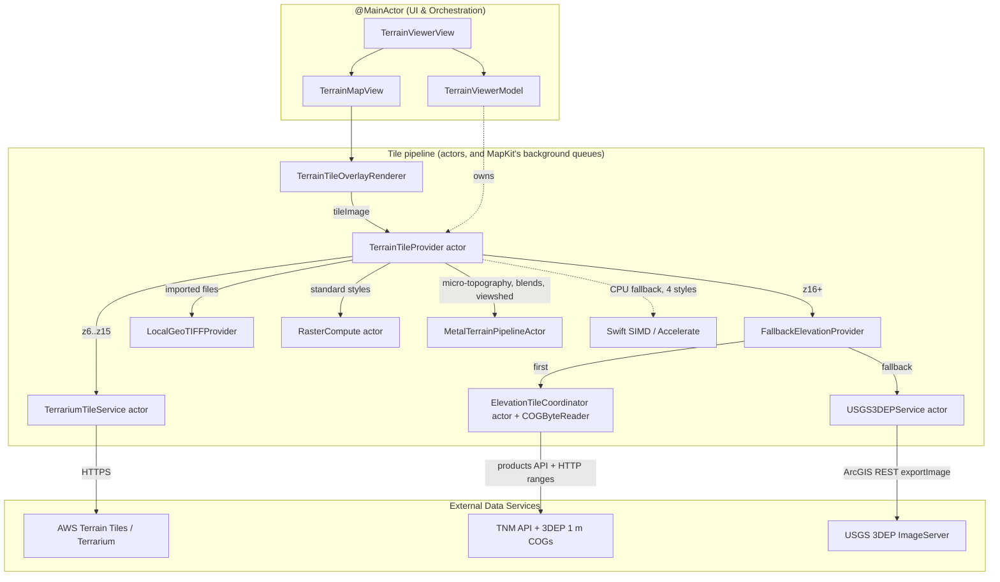

# LidarExplorer

High-performance iOS & iPadOS 27+ terrain viewer for iPad and iPhone, powered by USGS 3DEP 1-meter LiDAR elevation (streamed as Cloud Optimized GeoTIFFs), AWS Terrarium global elevation tiles, and Metal compute shaders.

---

## Overview

**LidarExplorer** is a native Swift 6 mapping application designed for geologists, archaeologists, outdoor navigators, and geospatial professionals. It streams, decodes, and dynamically illuminates digital elevation models (DEMs) directly on the device in real time.

Instead of displaying pre-baked, static hillshade imagery, LidarExplorer continuously derives slope, aspect, and multi-directional hillshading from raw float elevation grids using custom GPU compute kernels. Users steer the sun with a circular dial (or an Apple Pencil Pro barrel roll) and set its altitude in Settings, switch between 16 rendering styles — five standard ones (Hillshade, Multi-directional, Slope, Elevation with Topo/Turbo/Slate/Magma tints, Openness) and eleven micro-topography products (Red Relief, Local Relief, Sky-View, Raking Light, Relative Elevation, Curvature, Directional Occlusion, Positive and Negative Openness, VRM Ruggedness, Difference of Gaussians) — and layer the terrain over four USGS National Map basemaps or Apple's imagery.

---

## Key Capabilities & Highlights

- **Dynamic Metal GPU Shading:** Evaluates Horn's 3×3 finite-difference surface normals in parallel on the GPU. Where the fused kernel is unavailable (no Metal device, or the iOS Simulator, whose Metal rejects the shared linear texture it writes), the four basic styles (Hillshade, Multi-directional, Slope, Elevation) fall back to a CPU path (Swift SIMD + Accelerate vDSP/vForce); Openness and the micro-topography styles require Metal.
- **Multi-Directional Relief Visualization:** Solves the classic cartographic problem where single-direction lighting conceals landforms parallel to the illumination vector, exposing subtle natural and archaeological microtopography.
- **Tiered Elevation Pipeline:** AWS Terrarium global RGB tiles (about 0.2 s each) up to z15 for regional panning. From z16, USGS 3DEP 1-meter Cloud Optimized GeoTIFFs stream by HTTP range requests (the COG level follows the tile's metres per pixel, so at the screen-scale tiles of current iPad and iPhone displays every z16+ tile reads native 1 m). The 3DEP ImageServer, and then an upsampled Terrarium tile, are the fallbacks. GeoTIFFs you import take precedence where they cover.
- **Native MapKit Architecture:** an `MKTileOverlay` subclass describes the tile grid to MapKit, and a custom `MKTileOverlayRenderer` works out which tiles each map rect MapKit asks it to draw needs and draws them straight from the GPU's shared buffer, with no PNG encode or decode, so there is no modal loading step and no manual refresh.
- **Swift 6 Strict Concurrency:** Built in the Swift 6 language mode with complete concurrency checking (`SWIFT_STRICT_CONCURRENCY = complete`) and main-actor default isolation, across a `@MainActor` UI and actor-isolated background pipelines. The compiler checks the isolation boundaries except where the code opts out: about twenty `@unchecked Sendable` types (GPU-memory wrappers, image holders, MapKit overlays and lock-guarded stores), whose safety it does not verify (see Isolation Boundaries below); `@preconcurrency import Metal` in `RasterCompute` and `MetalTerrainPipelineActor`, which silences Sendable diagnostics for Metal's types in those two files; and four `MainActor.assumeIsolated` callbacks (three in `LocationService`, one in `TerrainMapView`), which are checked at run time.
- **Paid Upfront, No Tracking:** Ships with no advertising SDK, no in-app purchases and no tracking: the app collects nothing about the user, so App Tracking Transparency never applies.

---

## Features

- **Map styles:** 16 relief styles in the dock's style tray, and contour lines (0.25-50 m, Settings) on every style but Openness. With a micro-topography style shown, Settings adds a habitation-potential mask, sky-view shading and a blend layer (multiply, soft light, overlay or screen) that drapes a second product over it. More > Map Styles Guide explains each style.
- **Spot Inspection** (scope): tap for elevation, slope and aspect, plus the soil unit when soils are shown.
- **Cross-Section Profile** (ruler): tap A and B, or draw the line in one Apple Pencil stroke, for an elevation / slope / curvature profile with cut-and-fill, earthwork signatures and CSV / GeoJSON export.
- **Viewshed Analysis** (eye): place an observer, and drag the pin to move it, to see what is visible within 2.5 km.
- **Field Markup** (pencil): a PencilKit pen and highlighter in five inks, and waypoints, over the map, kept in a field notebook and exported as GeoJSON.
- **View in 3D** (cube): the shaded view draped on a SceneKit mesh, with orbit, pinch zoom and vertical exaggeration (1-10×).
- **Export** (More menu): the elevation, or a micro-topography style's analysis values, as a 32-bit float GeoTIFF.
- **Settings:** a river thalweg to draw for Relative Elevation; historical maps (an image with a world file, with opacity and a split wipe); SSURGO soil hatching and GeoJSON soil import; your own Float32 GeoTIFFs (up to four, held in memory until the app closes); GeoTIFF or PNG + PGW export of the map; offline downloads of an area (up to 2 GiB of elevation and 1 GiB of USGS basemap tiles); tile diagnostics.
- **Explore LiDAR Sites** (More menu): eight curated sites and your own bookmarks.
- **Apple Pencil Pro:** a barrel roll steers the sun under a hover ring; squeeze (cycles the profile metric) and double-tap (shows or hides the earthwork signatures) act in profile mode; on iPad, haptic cues play through the Pencil Pro.

With no tool lit, a tap does nothing and every one-touch drag, finger or Pencil, pans the map. Place search is not implemented (design only: `docs/superpowers/specs/2026-09-21-place-search-design.md`).

---

## Swift 6 Architecture & Complete Concurrency

LidarExplorer is built strictly under the Swift 6 language mode with complete concurrency checks enabled. Concurrency boundaries are clearly isolated by domain:


```mermaid
flowchart TD
    subgraph MainActor["@MainActor (UI & Orchestration)"]
        V[TerrainViewerView] --> M[TerrainViewerModel]
        V --> MV[TerrainMapView]
    end

    subgraph Pipeline["Tile pipeline (actors, and MapKit's background queues)"]
        MV --> R[TerrainTileOverlayRenderer]
        R -->|tileImage| TP[TerrainTileProvider actor]
        M -.->|owns| TP
        TP -->|z6..z15| TT[TerrariumTileService actor]
        TP -->|z16+| FB[FallbackElevationProvider]
        FB -->|first| EC[ElevationTileCoordinator actor + COGByteReader]
        FB -->|fallback| EP[USGS3DEPService actor]
        TP -->|imported files| LG[LocalGeoTIFFProvider]
        TP -->|standard styles| RC[RasterCompute actor]
        TP -->|micro-topography, blends, viewshed| MP[MetalTerrainPipelineActor]
        TP -.->|CPU fallback, 4 styles| CPU[Swift SIMD / Accelerate]
    end

    subgraph DataSources["External Data Services"]
        TT -->|HTTPS| S3[AWS Terrain Tiles / Terrarium]
        EC -->|products API + HTTP ranges| COG[TNM API + 3DEP 1 m COGs]
        EP -->|ArcGIS REST exportImage| USGS[USGS 3DEP ImageServer]
    end
```

### 1. Isolation Boundaries
- **UI & Presentation (`@MainActor`):** `TerrainViewerModel`, `TerrainViewerView`, and `LocationService` are bound to the main actor, ensuring all `@Observable` property mutations safely drive SwiftUI render passes without synchronization overhead.
- **Actor-Isolated Tile Pipelines:** network retrieval and caching run in actors: `TerrainTileProvider`, `TerrariumTileService`, `ElevationTileCoordinator` and `COGByteReader` (3DEP COGs), `USGS3DEPService` (ImageServer fallback), `TileDiskCache`, `SoilDataAccessClient` and `OfflineHarvestCoordinator`. The MapKit overlay classes (`TerrainTileOverlay`, `HillshadeTileOverlay`) are `nonisolated` `MKTileOverlay` subclasses, because MapKit calls them from background queues.
- **Metal Pipeline Concurrency (`RasterCompute`, `MetalTerrainPipelineActor`):** Metal reference types (`MTLDevice`, `MTLCommandQueue`, `MTLComputePipelineState`) are not `Sendable`, so they are confined to these two actors. GPU memory that must leave an actor travels in `@unchecked Sendable` wrappers (`MetalBufferLease`, `SurfaceLease`, `TerrainBitmap`, `ElevationSamples`, `COGMappedStorage`, `MappedFile`); `MetalBufferLease`, `SurfaceLease`, `TerrainBitmap` and `MappedFile` state in their doc comments why that is sound. The tile renderer's `TileImageStore` is a lock-guarded `@unchecked Sendable` class, because MapKit's `canDraw`/`draw` calls are synchronous. In all, about twenty types in the app are `@unchecked Sendable`, among them the MapKit overlays (`ViewshedOverlay`, `HistoricalMapOverlay`, and `SoilMultiPolygon`, whose `soilClass` is set once, right after construction), image- and raster-holding structs (`TileComposite.Tile`, `HistoricalMap.Imported`, `AnalysisTileSource`), the renderer's weak-reference box and the 3D scene.

### 2. Value Semantics & Sendable Data Types
- Geometry and elevation grids (`GeoRegion`, `ElevationGrid`, `TerrainDerivatives`, `ReliefProducts`) are immutable, thread-safe value types (`Sendable` structs).
- Domain outcomes are wrapped in `Evidence<Value>`, an enum (`.observed(Value, Provenance)` vs. `.unavailable(UnavailableReason)`). It eliminates ambiguous `nil` returns, records each value's `DataSource`, and models transport, decoding, coverage, plausibility and offline faults.

---

## Shading Engine & Metal GPU Compute

### Horn's Method (1981)
LidarExplorer calculates slope and aspect using B.K.P. Horn’s standard 3×3 finite-difference kernel:

$$\frac{\partial z}{\partial x} = \frac{(c + 2f + i) - (a + 2d + g)}{8 \cdot \Delta x}$$

$$\frac{\partial z}{\partial y} = \frac{(g + 2h + i) - (a + 2b + c)}{8 \cdot \Delta y}$$

Horn's formulation is the default in GDAL (`gdaldem`), ArcGIS and QGIS. The harness checks the GPU and CPU slopes against each other (to 0.01°) and against analytic grades, not against those tools' output.

### Multi-Directional Relief Shading
Standard single-azimuth hillshades obscure linear features that run parallel to the incoming light ray. Multi-directional relief shading evaluates surface illumination across multiple compass directions simultaneously, producing an illumination variance signal rendered as variable-opacity dark ink over the terrain. Flat ground remains transparent, while ridges, ditches, and terraces stand out sharply over any basemap.

### Seamless Tile Joins via Margin Padding
Because 3×3 convolution kernels cannot evaluate outermost boundary pixels without an adjacent neighbor, independent tile shading produces a 1-pixel dead border that causes visible grid seams. LidarExplorer solves this by:
1. Fetching a 4-pixel border skirt around each tile: real neighbouring samples for 3DEP and imported-GeoTIFF tiles (an expanded bounding box), but edge replication for z6-z15 Terrarium tiles, so in the standard styles a Terrarium join reads copied rather than real neighbour samples. (The micro-topography styles stitch the cached neighbouring tiles into their analysis raster instead.)
2. Dispatching the Metal kernel over the tile itself only, so each pixel's 3×3 window reads into the skirt and nothing has to be cropped. The CPU fallback, Openness and the older RRIM route (used only when the micro-topography pipeline is unavailable) still crop.
3. Sizing the raster to the screen: z16+ and imported-GeoTIFF tiles are fetched at the scale MapKit draws the overlay (each 256-point tile rounded up to a multiple of 64 px: 384 px on an iPad Pro 13" (M5), which draws it at about 1.477×, and 512 px at an exact 2×), while Terrarium tiles (z6-z15) keep the source PNG's 256 samples.

### Metal Acceleration & CPU Fallback
- **Metal Compute:** `TerrainKernels.metal` holds 29 compute kernels and a composite vertex/fragment pair. `RasterCompute` shades Hillshade, Multi-directional, Slope and Elevation in one fused dispatch (`terrain_surface_to_texture`, which computes the Horn derivatives itself), Openness with `compute_topographic_openness`, and computes derivative planes for the CPU fallback and the older RRIM route (`horn_derivatives_and_relief`, or `horn_slope_aspect` + `multidirectional_relief`). `MetalTerrainPipelineActor` runs nodata normalisation, the micro-topography products (LRM, RRIM, sky-view, raking light, REM, habitation, curvature, occlusion, the openness split, VRM, DoG), their blends and the viewshed.
- **CPU Fallback:** when the fused Metal kernel is unavailable (no Metal device or pipeline, and always on the iOS Simulator, whose Metal rejects the shared linear texture it writes), Hillshade, Multi-directional, Slope and Elevation tiles are shaded on the CPU (Swift SIMD and Accelerate vDSP/vForce) from derivative planes computed on first need and kept until the memory budget sheds them. `RasterCompute.reliefProducts` also stays on the CPU for grids under 65,536 cells. Openness and the micro-topography styles need Metal. On the Simulator they still run: Openness through `RasterCompute`'s buffer-only kernel, the micro-topography styles through `MetalTerrainPipelineActor`'s private textures and blits.
- **Real-Time Relighting:** each tile's padded elevation raster is cached, in memory and on disk (`Caches/TerrainGrids`, 500 MB). Turning the sun dial, rolling an Apple Pencil Pro, or moving Sun Altitude (or, for the low-sun micro-topography styles, Grazing Sun Altitude) in Settings re-shades the tiles on screen from that cache without refetching their elevation: one fused GPU dispatch per tile for Hillshade, Multi-directional, Slope and Elevation (the CPU path where that kernel is unavailable), while the micro-topography styles re-stitch the cached neighbouring rasters and run their GPU passes again. The dial writes the sun during a drag, at most every 50 ms.

---

## Tiered Elevation Data Architecture

To achieve fluid, uninterrupted panning alongside granular meter-level detail, LidarExplorer implements a tiered elevation strategy:

| Level | Zoom Range | Source Resolution | Source | Format / Endpoint | Latency |
| :--- | :--- | :--- | :--- | :--- | :--- |
| **Regional / Overview** | $z6 - z15$ | $\sim 2.4\text{ km} - 4.8\text{ m/px}$ (tile pixels, at the equator) | AWS Terrain Tiles | S3 Terrarium PNGs (RGB-encoded, 256 px) | $\sim 200\text{ ms}$ |
| **LiDAR Detail** | $z16 - z21$ | $1\text{ m}$ | USGS 3DEP | 1 m Cloud Optimized GeoTIFFs (LZW + floating-point predictor), found through The National Map products API and read by HTTP range requests. The 2 m and 4 m overviews are read only for tiles coarser than 1.7 m/px, which the screen-scale tiles of current iPad and iPhone displays never are. | On-demand |
| **Fallbacks** | $z16+$ | varies | USGS 3DEP ImageServer, then AWS Terrain Tiles | `exportImage` Float32 TIFF where the COGs cover under half the tile or fail; else the z15 Terrarium tile upsampled | On-demand |
| **Your Data** | any | the file's own | Imported GeoTIFF (Settings > Your Elevation Data) | Uncompressed Float32, held in memory; wins where it covers | Local |

### AWS Terrarium Tiles ($z6 - z15$)
Terrarium tiles encode elevation in meters across RGB color channels:

$$\text{elevation} = (R \times 256 + G + \frac{B}{256}) - 32768$$

These tiles are static, globally pre-rendered, and cached on disk via a dedicated 256 MB `URLCache`, delivering instantaneous response during map gestures.

### USGS 3DEP High-Resolution LiDAR ($z16+$)
From z16, `TerrainTileProvider` asks a `FallbackElevationProvider`. First comes `ElevationTileCoordinator`: it finds the 1 m 3DEP Cloud Optimized GeoTIFFs covering the tile through The National Map products API (`tnmaccess.nationalmap.gov`) and reads only the 256×256 COG tiles it needs with HTTP range requests (`COGByteReader`). It decompresses them with `TIFFLZWDecoder` (LZW + floating-point predictor) straight into page-aligned memory and normalises nodata on the GPU. It picks the COG level from the tile's metres per pixel (native 1 m below 1.7 m/px, the 2 m overview below 3.2 m/px, else 4 m); tiles are fetched at the scale MapKit draws the overlay, rounded up to a multiple of 64 px (384 px on an iPad Pro 13" (M5), 512 px at an exact 2×; a z16 tile at 384 px is about 1.6 m/px), so in practice z16 and deeper read native 1 m (the tile diagnostics still label z16 and z17 tiles "3DEP 4m (Overview)" and "3DEP 2m (Overview)", a stale label from `TerrainTileProvider.sourceName(forZ:)`). Where the 1 m COGs (up to three, newest first, merged) cover less than half the tile, the tile lies outside 3DEP's coverage box, or the COG fetch fails, `USGS3DEPService` asks the 3DEP ImageServer's `exportImage` for a Float32 TIFF, decoded by `FloatTIFFDecoder` (uncompressed only; strips or tiles, either byte order). If both fail, the Terrarium z15 tile above is upsampled so the map shows no hole.

---

## MapKit Integration & USGS Basemaps

The two tile layers use MapKit differently:

- **USGS basemaps** (`HillshadeTileOverlay`) override the asynchronous entry point `public override func loadTile(at path: MKTileOverlayPath) async throws -> Data` (MapKit's `loadTileAtPath:result:` is `NS_SWIFT_ASYNC(2)`; MapKit dispatches through this async form, and a completion-handler override is silently never called). They answer from tiles saved for offline use first, then the network, and cut tiles deeper than a service's maximum zoom from its deepest ancestor.
- **The terrain layer** (`TerrainTileOverlay`) is an `MKTileOverlay` only so that MapKit manages the tile grid; its `loadTile(at:)` throws `featureUnsupported`. `TerrainTileOverlayRenderer` overrides `canDraw` and `draw(_:zoomScale:in:)`, works out from the zoom scale which tiles a map rect needs (the bookkeeping `MKTileOverlayRenderer` would otherwise do), asks `TerrainTileProvider.tileImage` for each tile, and draws a `CGImage` over the shared `MTLBuffer` the kernel wrote. That avoids a PNG encode and decode per tile (8-18 ms). It also keeps coarser tiles as placeholders while finer ones load, and cancels loads for tiles that leave the screen.

### Supported Basemap Layers
In addition to the dynamic LiDAR overlay, LidarExplorer offers five basemaps (Settings > Basemap): four public USGS National Map services via `HillshadeTileOverlay` (beyond a service's native zoom its deepest tile is upsampled, and these tiles can be downloaded for offline use) and Apple's imagery:
1. **USGS Shaded Relief:** Small-scale national terrain context (native up to $z13$).
2. **USGS Imagery + Labels:** Orthophotography with place and road labels (native up to $z16$).
3. **USGS Imagery Only:** High-resolution orthophotography (native up to $z16$).
4. **USGS Topographic:** Official USGS quadrangle topographic maps (native up to $z16$).
5. **Apple imagery:** MapKit's own satellite imagery (`BasemapChoice.appleImagery`), drawn by MapKit rather than as a tile overlay, so it is not upsampled past z16 as the USGS imagery is; it has no opacity control and is not included in offline downloads.

---

## Privacy Architecture

LidarExplorer is designed with zero third-party tracking, zero advertising identifiers, and zero remote analytics. All elevation tile caches and user settings remain strictly on-device. The tile caches and offline downloads are kept out of backups; settings, bookmarks and the field notebook (`FieldNotebook.json` in the app's Documents folder) go only into the user's own device or iCloud backups. Network requests go only to public map and terrain services, and they necessarily carry the coordinates being viewed: USGS 3DEP and The National Map, AWS Open Data Terrain Tiles, Apple's MapKit basemaps, and — when soil hatching is switched on — the USDA Soil Data Access API. No account, identifier or usage data is sent with them.

---

## Project Structure Walkthrough

The codebase is organized into modular layers with clear separation of concerns:

```
LidarExplorer/                         # repository root
├── LidarExplorer.xcodeproj            # one app target (iOS/iPadOS 27), no test target, no packages
├── Config/                            # Info.plist (keys generated by the build) and PrivacyInfo.xcprivacy
├── LidarExplorer/                     # app sources: every file here is in the target
│   ├── LidarExplorerApp.swift         # @main: one WindowGroup showing TerrainViewerView
│   ├── Core/                          # math, rasters and Metal (no MapKit)
│   │   ├── Diagnostics/Log.swift      # os.Logger categories and signposts
│   │   ├── Geometry/                  # GeoRegion, ElevationGrid, UTMProjection, TerrainMeshBuilder
│   │   └── Raster/                    # RasterCompute and MetalTerrainPipelineActor (GPU actors), MicroTopographyReference
│   │       │                          # (CPU references), ReliefRenderer, ReliefStyleGuide, TerrainDerivatives, LayerBlend, GeoTIFFWriter
│   │       └── Shaders/TerrainKernels.metal   # 29 compute kernels + composite vertex/fragment
│   ├── Domain/                        # Evidence, ElevationProfile, ElevationTransect, TransectExporter, FieldMarkup, FieldNotebook,
│   │                                  # SoilSurvey, Landmark, SpotInspection, ElevationUnit, ProfileDecimation
│   ├── Services/
│   │   ├── Decoding/                  # FloatTIFFDecoder (uncompressed Float32), TIFFLZWDecoder (COG LZW + predictor)
│   │   ├── Elevation/                 # TerrariumTileService, ElevationTileCoordinator + COGByteReader (3DEP COGs),
│   │   │                              # ElevationService (USGS3DEPService, ImageServer), LocalGeoTIFFProvider, OfflineHarvestCoordinator
│   │   ├── Export/                    # GeoreferencedExportService (PNG + PGW; imports MapKit and UIKit)
│   │   ├── Soils/                     # SoilDataAccessClient (USDA SSURGO)
│   │   ├── Storage/                   # TileDiskCache, ElevationGridCoder, OfflineStorageBudget, FieldNotebookStore
│   │   └── Transport/                 # HTTPTransport
│   ├── MapLayer/                      # TerrainTileOverlay (provider, overlay, renderer), TerrainMapView, HillshadeTileOverlay (basemaps),
│   │                                  # AnalysisRasterBuilder, MercatorMosaicBuilder, TileComposite, ThalwegBuilder, HistoricalMap(+Overlay),
│   │                                  # SoilHatchOverlay, ViewshedOverlay, PencilMarkupOverlay, StrokeGeoreferencer, TerrainHarvestSource
│   ├── Presentation/                  # TerrainViewerView/Model, ViewerTopBarView, ShadingDockView + SunDialControl, ElevationProfileView,
│   │                                  # ViewerSettingsSheetView, MapStylesReferenceView, VisualPrimerView, LandmarkCatalogView, FieldMarkupView,
│   │                                  # OfflineHarvestView, Terrain3DOrbitView, MapTouchPolicy, haptics, Pencil Pro roll, TileDebugView, LocationService
│   └── Assets.xcassets
├── Tools/
│   ├── run-harness.sh                 # offline regression harness (the verification command)
│   ├── ViewerHarness/                 # main.swift, HarnessRun.swift and 25 *Checks.swift files
│   ├── run-live-check.sh, LiveCheck/  # live-network check (source list out of date, see below)
│   ├── SceneKitTextureProbe.swift
│   └── Fixtures/                      # a real 3DEP COG tile for the LZW decode checks
├── docs/superpowers/                  # NEXT_STEPS_FOR_AGY.md (history; the live handoff is STATUS.md plus the local
│                                      # .agent/HANDOFF.json); plans, specs and reviews (historical records)
├── Archive/                           # LegacyArchaeology/ notes and Datasets/ (not bundled)
├── gemini-lidar-techniques.pdf        # despite its name, a one-page printout (the end of a longer Gemini chat) listing French,
│                                      # and one English, maps of the Mississippi from 1684-1764 (candidate historical maps);
│                                      # not lidar techniques
├── STATUS.md                          # verification state, open defects, device-test backlog
└── README.md
```

---

## Development, Verification & Testing

The current verification state is kept in [STATUS.md](STATUS.md): the harness count, the builds, what has run on a device versus only in the Simulator, open defects and the device-test backlog. Plans, specs and reviews are under `docs/superpowers/` and are historical records.

Apart from `Services/Export/GeoreferencedExportService.swift` (MapKit and UIKit) and a `canImport(UIKit)` hook in `MetalTerrainPipelineActor` that purges idle pools on a memory warning or on entering the background, the `Core`, `Domain` and `Services` layers have no UIKit dependency. Together with the parts of `MapLayer` that need only MapKit, `TerrainViewerModel` and the presentation policy types (62 app files in all), they compile and run on the macOS host with no Simulator, no test target and no change to the Xcode project. The other 25 app files (the SwiftUI views, `TerrainMapView`, `ViewshedOverlay`, `PencilMarkupOverlay`, `HapticFeedbackManager`, `TerrainViewerModel+OfflineHarvest` and the PNG + PGW exporter among them) are compiled only by `xcodebuild`.

### 1. Running the Offline Regression Harness
Compiles the Metal shaders with `xcrun metal` into a `default.metallib` kept in `.harness-build/` (rebuilt when the shader, the toolchain, the flags or the source list change, or with `HARNESS_CLEAN=1`). It builds the app's host-compilable sources and `Tools/ViewerHarness/` incrementally with the app's concurrency settings (`-swift-version 6 -strict-concurrency=complete -default-isolation MainActor` plus `MemberImportVisibility`, `InferIsolatedConformances`, `NonisolatedNonsendingByDefault`), optimised with `-O` and without the Debug build's `DEBUG` condition, so `#if DEBUG` code is type-checked only by `xcodebuild`, as are the blocks a Mac host compiles out (`#if canImport(UIKit)`, `#if os(iOS)`, `#if targetEnvironment(simulator)`). Then it runs every check. A full run ends with `ALL CHECKS PASSED`; the current count is in STATUS.md (1605 checks on 2026-10-01). Pass a directory to keep the rendered PNGs (`./Tools/run-harness.sh render-dir`). `HARNESS_ONLY=B12,W1` runs only the named sections (it never prints ALL CHECKS PASSED, and exits 2 if a name matches nothing); `HARNESS_CLEAN=1` rebuilds from scratch; `HARNESS_BUILD_DIR=dir` moves the build.

```bash
./Tools/run-harness.sh
```

**What it verifies:**
- Coordinate transform and distance math precision across extreme elevations.
- GPU and CPU Horn slope agree within 0.01°.
- Robust percentile clipping (ignoring outlier spikes in LiDAR data).
- Valid handling and decoding of little-endian, big-endian, and LZW-compressed floating-point TIFFs.
- Micro-topography kernels: LRM, RRIM, sky-view, raking light, REM, curvature, habitation, the viewshed and differential openness against CPU references (`MicroTopographyReference`); occlusion, the openness split, VRM and DoG by range and shape checks; blends; GPU time budgets on a 1024 x 1024 raster (LRM and RRIM under 8 ms) and a warm 16 ms render budget per style at z18-z20.
- The tile provider and renderer: tiering, skirts and seams, caching, re-shading, culling and memory budgets.
- COG streaming (the LZW + predictor decode of a real 3DEP tile matched to the values GDAL reads from it), GeoTIFF import and export, the offline downloader and its storage.
- Transects and earthwork signatures, field markup and the notebook, persistence, and the 3D mesh.
- Interaction rules with no UI: the map touch policy, top-bar layout, sun-dial geometry, Pencil roll and haptic routing.

### 2. Running the Live Network Integration Check
Fetches live tiles and rasters from AWS Terrarium, 3DEP COGs (via The National Map products API), the 3DEP ImageServer, the USGS basemaps and USDA Soil Data Access. It checks tiering, seams, relighting from cache, COG-vs-ImageServer agreement and SSURGO parsing:

```bash
./Tools/run-live-check.sh
```

*(Note: needs internet access to `s3.amazonaws.com`, `tnmaccess.nationalmap.gov`, `prd-tnm.s3.amazonaws.com`, `elevation.nationalmap.gov`, `basemap.nationalmap.gov` and `sdmdataaccess.sc.egov.usda.gov`. Its source list was last updated on 2026-09-12. It lacks files the tile provider has needed since 2026-09-20 and 2026-09-21 (`LayerBlend`, `TileComposite`, `LocalGeoTIFFProvider`, `OfflineHarvestCoordinator`, `OfflineStorageBudget`, `TerrainHarvestSource`) and the app's two approachable-concurrency features, so expect it not to compile until the script is brought up to date (inferred from its source list, not run). It also builds in a temporary folder outside the repository. Its last recorded result is 67 PASS / 0 FAIL on 2026-09-18 (STATUS.md).)*

---

## System Requirements & Build Settings

- **Platforms:** iOS 27.0+ / iPadOS 27.0+ (`IPHONEOS_DEPLOYMENT_TARGET = 27.0`), iPhone and iPad (`TARGETED_DEVICE_FAMILY = "1,2"`)
- **Toolchain:** Xcode 27.0+ (the current builds used Xcode-beta, build 27A5252f, with the iOS 27.0 SDK; when `DEVELOPER_DIR` is unset, `Tools/run-harness.sh` and `Tools/run-live-check.sh` use `/Applications/Xcode-beta.app`, then `/Applications/Xcode.app`)
- **Language:** Swift 6 with complete strict concurrency, main-actor default isolation and approachable concurrency (`SWIFT_STRICT_CONCURRENCY = complete`, `SWIFT_DEFAULT_ACTOR_ISOLATION = MainActor`, `SWIFT_APPROACHABLE_CONCURRENCY = YES`)
- **Dependencies:**
  - Zero third-party packages (native Swift and Metal Shading Language only)
  - Native frameworks: `SwiftUI`, `UIKit`, `MapKit`, `Metal`, `CoreGraphics`, `ImageIO`, `Accelerate`, `simd`, `CoreLocation`, `SceneKit` (3D view), `PencilKit` (field markup), `Charts` (profile), `UniformTypeIdentifiers`, `Observation`, `OSLog`

---

## License & Data Attribution

- **USGS 3DEP Elevation Data:** Courtesy of the U.S. Geological Survey (USGS), public domain.
- **AWS Terrain Tiles:** Hosted on AWS Open Data registry, provided by Mapzen and partners.
- **USGS The National Map:** Map services courtesy of USGS National Geospatial Program.
- **USDA NRCS Soil Survey (SSURGO):** soil map units from the Soil Data Access service, courtesy of the USDA Natural Resources Conservation Service.
- **Apple Maps:** the Apple imagery basemap and MapKit base layer, © Apple and its data providers (MapKit shows its own legal notice on the map).
