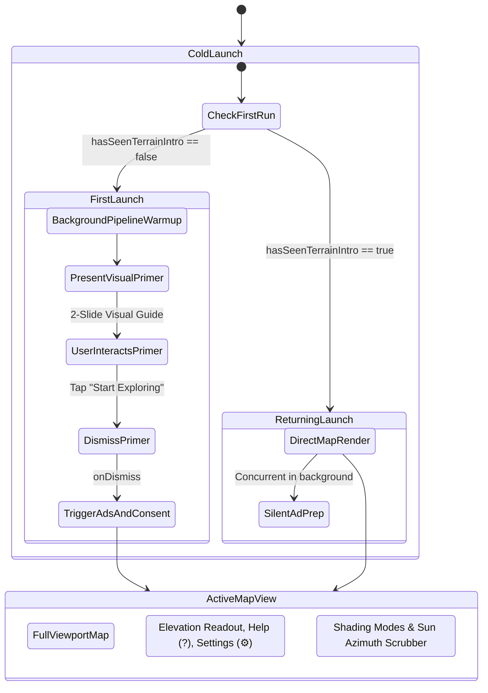

# User Flow & Map HUD Redesign

**Date:** 2026-09-07  
**Status:** Validated Design Spec  
**Target:** LidarExplorer (iOS)

---

## 1. Executive Summary & Intent

LidarExplorer is a general-purpose, nationwide bare-earth lidar visualization utility for the United States, powered by USGS 3DEP high-resolution digital elevation models (DEM) and AWS Terrain Tiles.

The current user experience suffers from two main friction points upon launch:
1. **First-Run Cognitive Overload**: New users are greeted immediately by a full-screen text document ([`OnboardingView.swift`](file:///Users/herren/dev/LidarExplorer/LidarExplorer/Presentation/OnboardingView.swift)) describing azimuth, sun angles, and multidirectional shading mathematically before the user has seen or interacted with the terrain canvas.
2. **Viewport Obstruction**: The map's primary control panel ([`ControlPanelView`](file:///Users/herren/dev/LidarExplorer/LidarExplorer/Presentation/TerrainViewerView.swift)) is an expanded right-hand sidebar covering nearly 40% of the screen width on iPhone, obscuring the terrain and requiring manual dismissal to view the full map.
3. **Ad & Consent Collisions**: Google UMP privacy consent requests trigger concurrently with the onboarding sheet on first open, risking alert presentation conflicts.

This redesign introduces:
- **`VisualPrimerView`**: A lightweight, 2-slide visual primer demonstrating (1) bare-earth canopy stripping and (2) dynamic relief relighting via shadows, dismissible in 1 tap.
- **Floating Bottom HUD (`ViewerBottomDockView`)**: An unobtrusive, GIS-style floating dock above the safe area that exposes the two most essential interactions: direct thumb-scrubbing of the sun azimuth angle and 1-tap switching of the 4 shading modes.
- **Streamlined Top Bar (`ViewerTopBarView`)**: Houses a compact elevation pill (`📍 542 ft`), a quick help button (`?` to re-summon the primer), and a settings button (`⚙️`).
- **Settings Sheet (`ViewerSettingsSheetView`)**: Consolidates secondary adjustments (sun altitude, vertical exaggeration, basemap style, elevation units, ad removal, and diagnostic logs) into a standard iOS modal sheet.

---

## 2. User Lifecycle & Transition Flow



### 2.1 First-Launch Sequence (`!hasSeenTerrainIntro`)
1. On app start, [`TerrainMapView`](file:///Users/herren/dev/LidarExplorer/LidarExplorer/MapLayer/TerrainMapView.swift) and background Metal render pipelines initialize and begin tile retrieval.
2. `VisualPrimerView` presents as a sheet over the map.
3. User navigates the 2 visual slides:
   - **Slide 1: Bare-Earth Concept**: Visual illustration showing foliage and buildings digitally stripped from USGS 3DEP scans to reveal underlying topography.
   - **Slide 2: Dynamic Relighting**: Visual illustration showing how raking light exposes subtle trenches, foundations, and elevation contours.
4. User taps **"Start Exploring"** (or swipes down):
   - `@AppStorage("hasSeenTerrainIntro")` is marked `true`.
   - The sheet dismisses smoothly to reveal the live, pre-rendered map.
   - `onDismiss` kicks off `ads.prepare(hasRemoveAds:)` to present Google UMP consent without modal collision.

### 2.2 Returning Launch Sequence (`hasSeenTerrainIntro == true`)
1. App opens straight to the full-screen interactive terrain map.
2. No onboarding modals or tutorial overlays are presented.
3. `ads.prepare(hasRemoveAds:)` runs concurrently in the background.
4. The user can reopen `VisualPrimerView` at any time by tapping the **`?`** button in the top bar.

---

## 3. Component Architecture & UI Layout

```
+-------------------------------------------------------------------+
|  [📍 542 ft]                                            [?]  [⚙️] | <-- Top Bar (ViewerTopBarView)
|                                                                   |
|                                                                   |
|                                                                   |
|                                                                   |
|                    UNOBSTRUCTED 3D TERRAIN MAP                    |
|                        (TerrainMapView)                           |
|                                                                   |
|                                                                   |
|                                                                   |
|      +-----------------------------------------------------+      |
|      | [Multi-Dir] [Hillshade] [Slope] [Elevation]     (•) |      | <-- Floating Dock
|      | ☀️ Sun  [---------O--------------------]   315°     |      |     (ViewerBottomDockView)
|      +-----------------------------------------------------+      |
+-------------------------------------------------------------------+
|                        [ BannerAdSlot ]                           | <-- Safe Area Inset
+-------------------------------------------------------------------+
```

### 3.1 `VisualPrimerView` (Replacing `OnboardingView`)
- **Container**: `NavigationStack` hosted inside a sheet with interactive dismiss enabled.
- **Paging Mechanism**: Horizontal `TabView` with `.tabViewStyle(.page(indexDisplayMode: .always))`.
- **Slide 1**:
  - Icon / Visual: Custom symbol / graphic representing radar pulses through canopy to bedrock (`antenna.radiowaves.left.and.right` / `mountain.2.fill`).
  - Heading: "Bare-Earth Topography"
  - Description: "USGS 3DEP lidar digitally strips away vegetation and structures, revealing subtle earthworks, fault lines, and terrain contours that are invisible from aerial photos."
- **Slide 2**:
  - Icon / Visual: Directional sun dial graphic (`sun.max.fill` casting relief shadow).
  - Heading: "Relighting the Ground"
  - Description: "Features parallel to light stay hidden in shadow, while raking light brings out faint details. Sweep the sun slider to inspect the terrain from any angle."
- **Action Button**: Pinned at the bottom: `"Start Exploring"` (primary filled capsule button).

### 3.2 `ViewerTopBarView`
- **Leading**: `ElevationReadoutView` styled as an ultra-compact glass capsule (`.regularMaterial`, rounded capsule):
  - When elevation is available: `Image(systemName: "mountain.2")` + `"\(formattedElevation)"`.
  - When idle: `"Tap map for elevation"`.
- **Trailing**:
  - Help Button: Circular button with `Image(systemName: "questionmark")`, opens `showsPrimer = true`.
  - Settings Button: Circular button with `Image(systemName: "gearshape")`, opens `showsSettings = true`.

### 3.3 `ViewerBottomDockView` (Floating Dock)
- **Positioning**: Centered horizontally at the bottom, padded above the safe-area / banner ad slot.
- **Background**: `.regularMaterial` or `.ultraThinMaterial` with a subtle border (`rgba(255,255,255,0.15)`), rounded corners (`18pt`), and drop shadow.
- **Row 1 (Shading Mode Selector & Activity Indicator)**:
  - Mode Switcher: Segmented picker or horizontal pill buttons for `ShadingMode`:
    - `Multi-Directional` (default)
    - `Hillshade`
    - `Slope`
    - `Elevation`
  - Activity Badge: Subtle animated spinner or pulsing dot that illuminates while `model.isDownloading` or `model.isRendering` is active, and hides when idle.
- **Row 2 (Quick Sun Scrubber)**:
  - Visible when `shadingMode == .hillshade` (or optionally in all modes where azimuth influences render).
  - Contains:
    - Sun icon: `Image(systemName: "sun.max.fill")`
    - Continuous slider bound to `model.sunAzimuth` (0°...360°), debounced at 16ms to avoid Metal pipeline thrashing.
    - Numeric readout: Monospaced integer degree indicator (`"315°"`).

### 3.4 `ViewerSettingsSheetView`
- **Container**: `NavigationStack` presented as a form/list sheet with title `"Terrain Settings"`.
- **Sections**:
  1. **Lighting & Exaggeration**:
     - Sun Altitude Slider (`model.sunAngle`: 5°...85°).
     - Vertical Exaggeration Slider (`model.verticalExaggeration`: 1.0×...5.0×).
  2. **Basemap**:
     - Picker for `model.selectedBasemap`: USGS Topo, USGS Imagery, USGS Imagery + Topo.
  3. **Units & Display**:
     - Picker for `model.elevationUnit`: Feet (ft) vs. Meters (m).
  4. **Upgrades & Purchases**:
     - StoreKit section: "Remove Ads" button (price localized, purchase/restore handler via `StoreService`).
  5. **Diagnostics**:
     - "Tile Pipeline Logs" navigation row opening `TileDebugView(log: model.tileLog)`.
  6. **Data Attributions**:
     - USGS 3DEP, AWS Terrain Tiles, The National Map attribution strings.

---

## 4. State Management & Data Flow

| State Property | Scope | Purpose |
| :--- | :--- | :--- |
| `hasSeenTerrainIntro` | `@AppStorage` | Persists whether first-run primer has been shown. |
| `showsPrimer` | `@State` | Controls presentation of `VisualPrimerView`. |
| `showsSettings` | `@State` | Controls presentation of `ViewerSettingsSheetView`. |
| `showsDebug` | `@State` | Controls presentation of `TileDebugView`. |
| `model.shadingMode` | `TerrainViewerModel` | Active shading mode (multiDirectional, hillshade, slope, elevation). |
| `model.sunAzimuth` | `TerrainViewerModel` | Sun compass direction (0°–360°), throttled to 16ms. |
| `model.sunAngle` | `TerrainViewerModel` | Sun elevation angle (5°–85°). |
| `model.verticalExaggeration` | `TerrainViewerModel` | Vertical exaggeration multiplier (1.0–5.0). |
| `model.selectedBasemap` | `TerrainViewerModel` | Selected base map layer. |
| `model.elevationUnit` | `TerrainViewerModel` | Elevation display units. |

---

## 5. Non-Goals

1. **Curated Landmark Tours / Site Bookmarks**: The app remains a pure, nationwide viewer. There are no hardcoded tourist destinations or site carousels.
2. **Offline Data Bundling**: Tiles continue to stream on-demand from USGS 3DEP and AWS Terrain services with existing local disk caching.
3. **Complex GIS Editing**: No polygon drawing, shapefile exporting, or measurement tool additions.

---

## 6. Verification & Testing Criteria

1. **First-Launch Experience**:
   - Clearing UserDefaults (`hasSeenTerrainIntro = false`) presents `VisualPrimerView` on launch.
   - Paging between Slide 1 and Slide 2 is fluid and displays correct graphics/copy.
   - Tapping "Start Exploring" dismisses the sheet and persists `hasSeenTerrainIntro = true`.
   - Google UMP / consent alerts only execute after the primer dismisses.
2. **Returning-Launch Experience**:
   - App cold start with `hasSeenTerrainIntro == true` displays the map immediately with zero modals.
3. **Dock & Controls Usability**:
   - Switching shading modes directly changes the active Metal rendering pipeline.
   - Dragging the sun azimuth slider updates the hillshade in real time without dropping frames (16ms throttle).
   - Tapping `?` reopens `VisualPrimerView` on demand.
   - Tapping `⚙️` presents `ViewerSettingsSheetView`.
4. **Ad Placement & Layout**:
   - Floating dock does not overlap `BannerAdSlot` across iPhone standard and Plus/Max screens.
5. **Automated Regression Suite**:
   - `Tools/run-harness.sh` compiles and passes all 46 unit/integration tests.
   - `Tools/run-live-check.sh` passes 100%.
   - Clean compilation in `xcodebuild` targeting iOS 17+.
